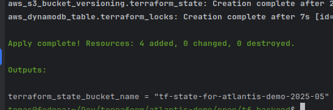
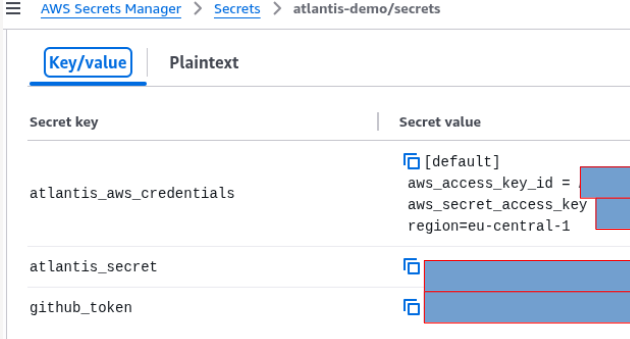
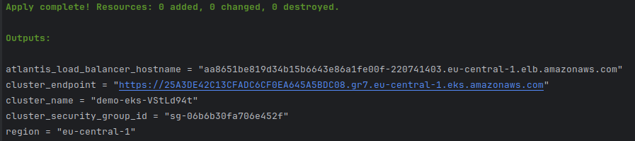
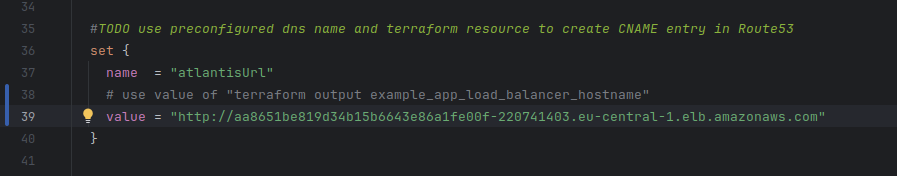
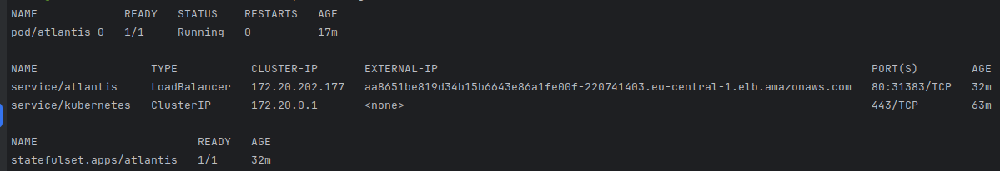
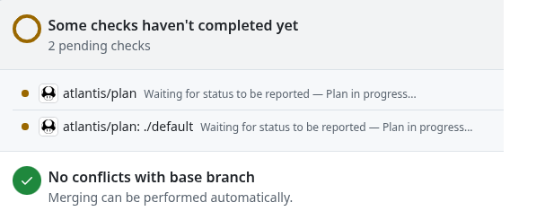
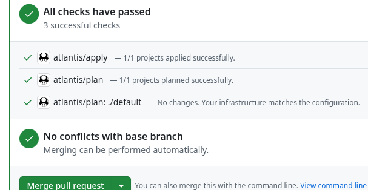
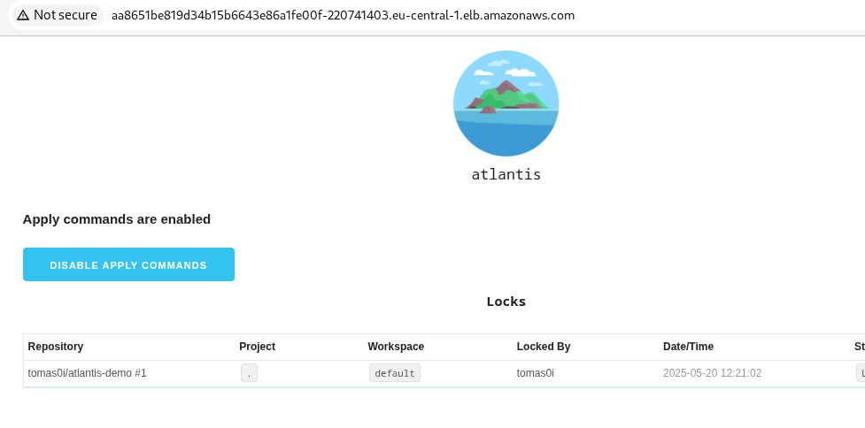
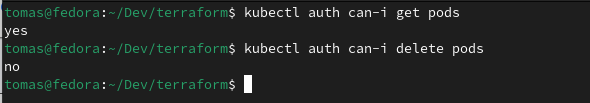
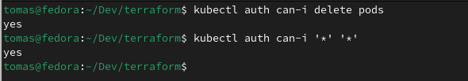

# Atlantis Demo

## Prerequisites:

- generate  access token for github :https://www.runatlantis.io/docs/access-credentials.html#github-user
- deploy terraform   backend resources : https://github.com/tomas0i/atlantis-demo/blob/main/prep/tf_backend/backend.tf

 

  update terraform backend config with s3 bucket name in https://github.com/tomas0i/atlantis-demo/blob/main/terraform.tf#L4

- set up required secrets in AWS secrets manager:
  name should match: one defined in variables.tf:
  https://github.com/tomas0i/atlantis-demo/blob/main/variables.tf#L20

  github token,
  atlantis secret,
  aws credentials (with enough permissions for atlantis to execute terraform)
  
  
  can be created from terraform:
  https://github.com/tomas0i/atlantis-demo/blob/main/prep/secrets/secrets.tf

## Deploy EKS cluster and atlantis helm chart with terraform

- execute terarform init, terraform plan  and apply from main directory
  once resources created, note the value of atlantis_load_balancer_hostname output:
  
  and update atlantisUrl value vith http://<output value>:
  
  in https://github.com/tomas0i/atlantis-demo/blob/main/atlantis.tf#L39
  and run terraform apply once again
  (more suitable approach would be to register domain and use Rout53 entry)

## Finish atlantis configuration in github repo

- add webhook as described here : https://www.runatlantis.io/docs/configuring-webhooks.html
  use http:://<atlantis_load_balancer_hostname> and atlantis_secret values from AWS secret manager

## Verify
- configure kubectl with new eks cluster :
  aws eks --region eu-central-1 update-kubeconfig --name d<your cluster name>
  verify atlantis with e.e kubectl get all:

 

- make a pull request and verify atlantis in action:

 

 

- check in atlantis runner endpoint http://<elb endpoint>

 

## Verify cluster RBAC:

- setup aws profiles for manage and readonly IAM users that assume respective roles 
  role ARNs should be:
  arn:aws:iam::<AWS_ACCOUNT_ID>:role/<EKS_CLUSTER_NAME>-eks-readonly

  and

  arn:aws:iam::<AWS_ACCOUNT_ID>:role/<EKS_CLUSTER_NAME>-eks-admin

- verify read only role:
  aws eks --region eu-central-1 update-kubeconfig --name <EKS_CLUSTER_NAME> --profile eks-viewer

  

- verify cluster admin role

  aws eks --region eu-central-1 update-kubeconfig --name <EKS_CLUSTER_NAME> --profile eks-admin

  
  
  
  
 
  
